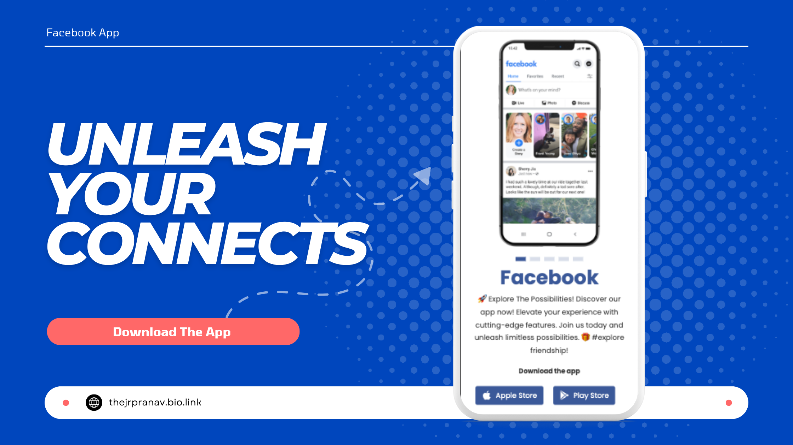

<div align="center">


[](https://twitter.com/Pranav_Jadhav09)
[](https://thejrpranav09.hashnode.dev/building-an-engaging-facebook-landing-page-a-web-development-odyssey)

<br />
<br />

  

<h2 align="center">Facebook - Landing Page</h2>
Facebook is a fully responsive landing page website, responsive for all devices, built using HTML5, CSS3, and JavaScript.

<a href="https://pranav-jadhav09.github.io/responsive-facebook-landing-page/"><strong>➥ Live Demo</strong></a>

</div>

<br />

### Demo Screenshots

 

### Prerequisites

Before you begin, ensure you have met the following requirements:

- [Git](https://git-scm.com/downloads "Download Git") must be installed on your operating system.

### Run Locally

To run **Pepsi Landing Page**, run this command on your git bash:

Linux and macOS:

```bash
sudo git clone https://github.com/Pranav-Jadhav09/responsive-facebook-landing-page.git
```

Windows:

```bash
git clone https://github.com/Pranav-Jadhav09/responsive-facebook-landing-page.git
```

### License

MIT
